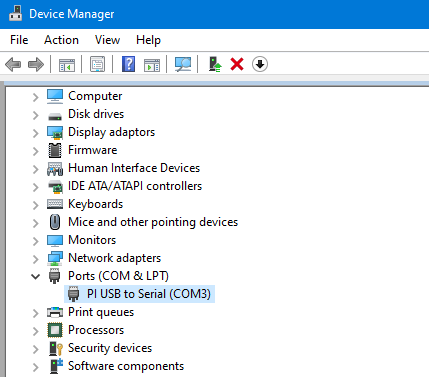
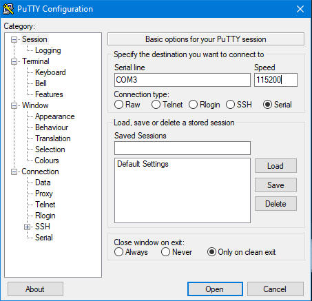

# About

ElCheapoAIS-nmea is a relay for AIS messages, sending received AIS messages, including your own position, speed etc
to land using your regular (satellite) internet connection.

# Hardware installation

* Connect the A, B and GND screw headers to an NMEA 0183 output on your AIS or NMEA hub
* Connect the USB cable to a USB charger

# Default configuration

* NMEA bus
  * 38400 baud, 8bit, no flow control, 1 stop bit (8N1).

* AIS downsampling
  * Lowest of a total of 100 messages / sec or 10 messages / sec / mmsi.

# First time configuration

1) Connect the USB to a PC (the USB normally used to power the device)

2) Wait until the serial port appears. In Windows you can see it in the Device Manager:

3) Open a terminal program like PuTTY or Minicom and instruct it to connect to
the USB serial port the device presents as (/dev/ttyACM? under linux,
COM?: under windows). 

In PuTTY the configuration for the early screenshot would look like:

You should be presented with a Linux command prompt, e.g. something like

    root@orangepizero:~# 

You can now use any of the commands below to configure the device.

# Network configuration

To connect to the WiFi called MYSSID with the password MYPASSWORD use
the nmcli command like this

    nmcli con add con-name SOMENAME ifname wlan0 type wifi ssid MYSSID wifi-sec.key-mgmt wpa-psk wifi-sec.psk MYPASSWORD
    nmcli con up SOMENAME

You can verify that you have acquired an ip number using the command

    ifconfig wlan0

# NMEA configuration

All the NMEA / AIS configuration resides in the file
/etc/elcheapoais/config. It can be inspected using

    cat /etc/elcheapoais/config

The format is just name="value". Note that values need to be quoted,
and no extra space is allowed outside of the quotes.

There is no simple way to edit the file, but you can replace it in its
entirety:

    cat > /etc/elcheapoais/config <<EOF
    Copy-paste in modified file contents here
    EOF

# Applying new config

Apply new configuration by rebooting the device by issuing the command

    reboot now
