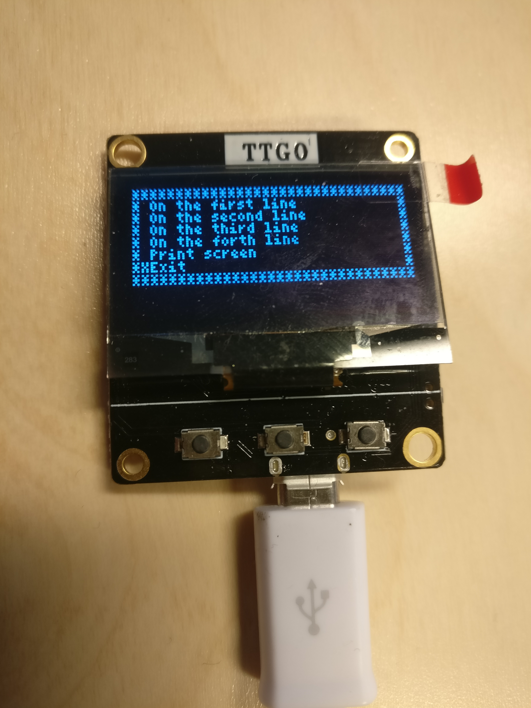

# TTyGO

TTyGO is a simple VT220 compatible serial terminal with some XTerm
extensions with optional UTF-8 support. Hardware buttons act as VT220
programmable function keys, and there is an on screen keyboard
available.

It uses the [U8g2lib graphical library](https://github.com/olikraus/u8g2/wiki), so it is compatible with a lot of displays.

* [Building](docs/Building.md)
* [Usage](docs/Usage.md)
* [Resources](docs/Resources.md)

## Tested on

### [TTGO OLED ESP8622 SH1106](https://www.aliexpress.com/item/32991442463.html?spm=a2g0s.9042311.0.0.27424c4d5SbjHq)

Either either the serial-over-usb connection, or the physical TTL
level serial port can be used. Maximum serial speed is 115200baud and
maximum screen size is 24x12 characters. 3 physical buttons leading to
6 (or 5 with the on screen keyboard enabled) programmable functions.
All software features can be enabled.

### [Arduboy (Production version)](https://www.aliexpress.com/item/32814857145.html)

Maximum serial speed is 9600baud and maximum screen size is 24x12
characters. 6 physical buttons leading to 12 (or 11 with the on screen
keyboard enabled) programmable functions. Software features are limited by
available memory - in particular there is no unicode support.

